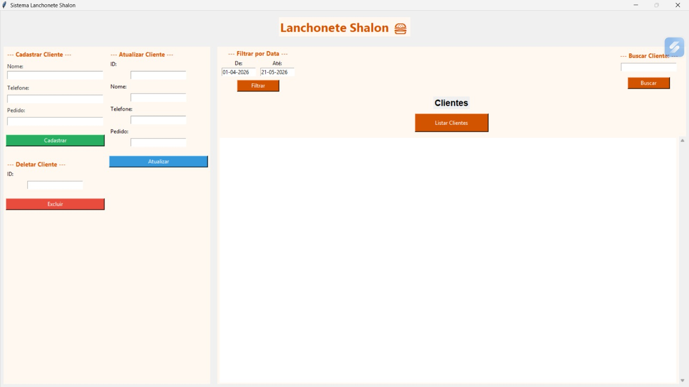
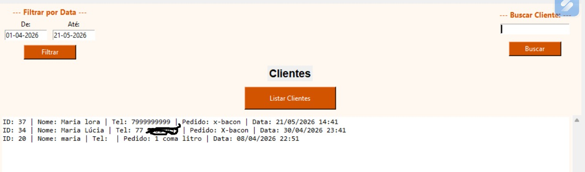
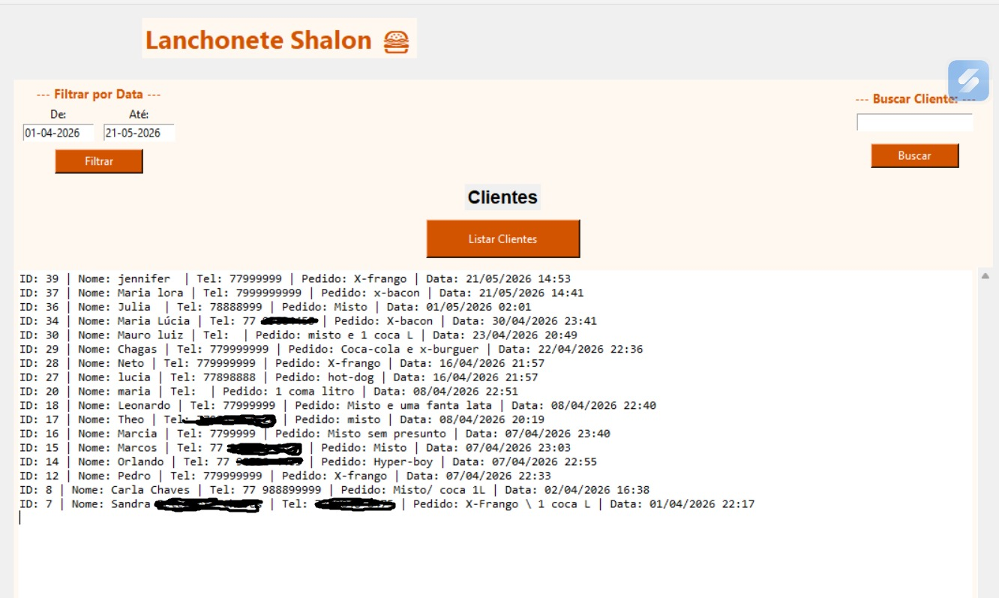

# 🍔 Sistema de Cadastro para Lanchonete

Sistema desenvolvido em Python com interface gráfica em Tkinter para cadastro e gerenciamento de clientes e pedidos.

## 📌 Sobre o projeto

Esse projeto foi criado com o objetivo de praticar desenvolvimento com Python, integração com banco de dados e construção de interfaces gráficas.

O sistema permite cadastrar clientes, registrar pedidos, buscar informações já salvas e atualizar registros existentes de forma simples e organizada.

---

## ✨ Funcionalidades:

- Cadastro de clientes
- Cadastro de telefone
- Registro de pedidos
- Listagem de clientes cadastrados
- Busca por nome
- Filtro por período (data inicial e final)
- Atualização de cadastro pelo ID
- Preenchimento automático dos dados ao informar o ID
- Interface gráfica intuitiva com Tkinter

---

## 🛠️ Tecnologias utilizadas:

- Python 3
- Tkinter
- PostgreSQL
- Psycopg2
- Git / GitHub

---

## 📷 Imagens do sistema:

### Tela principal



### Campo de busca de clientes



### Listagem de clientes



---

## ▶️ Como executar o projeto:

Clone o repositório:

```bash
git clone https://github.com/EmilleChaves/sistema-lanchonete-python.git
```

Acesse a pasta do projeto:

```bash
cd sistema-lanchonete-python
```

Instale as dependências:

```bash
pip install psycopg2
```

Execute o projeto:

```bash
python interface.py
```

---

## 👩‍💻 Desenvolvido por:

**Emille Chaves :D**
Estudante de Análise e Desenvolvimento de Sistemas
